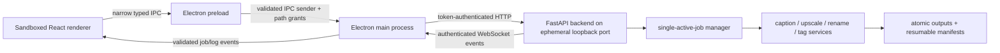

# TrainKit architecture

TrainKit separates the untrusted desktop UI from filesystem and model execution.

## Desktop boundary

`src/main.ts` owns windows, native dialogs, path capabilities, backend proxying, and external navigation. Browser windows use `sandbox: true`, `contextIsolation: true`, and `nodeIntegration: false`. Only allowlisted HTTPS hosts can open externally. IPC handlers verify that the caller is the expected main or splash renderer.

`src/preload.ts` exposes a small typed API. The renderer can request a directory or file picker, operate only within granted paths, submit allowlisted backend routes, and receive sanitized status/job/log events. It does not know the Python port or authentication token.

`src/runtime-paths.ts` is the single authority for packaged paths. `src/setup-manager.ts` installs the locked Python environment beside the packaged backend under `resources/backend`, including its managed Python interpreter. uv's cache and temporary directory also stay there during setup and are removed after success. A marker binds the environment to the desktop version and `uv.lock` SHA-256. Session logs are stored under `logs` beside the executable.

Because the packaged runtime is self-contained, TrainKit must be extracted or installed in a folder the current user can write to. Setup checks this before downloading multi-gigabyte dependencies and reports the exact rejected path.

## Backend boundary

`src/backend-manager.ts` selects an available loopback port, generates a 256-bit token for each launch, starts Python with the version/token/origin in its environment, authenticates every request, and validates the reported backend version before declaring readiness.

`backend/main.py` rejects unauthenticated HTTP traffic. `backend/core/websocket.py` independently checks the token and desktop origin. No permissive CORS policy is installed.

`backend/core/jobs.py` permits one active heavyweight job, assigns explicit job IDs, records terminal states, broadcasts progress after completed work, and supports cooperative cancellation. Caption generation also checks cancellation between generated tokens; tiled upscaling checks between tiles.

## Data pipeline

Every operation enumerates verified images in deterministic natural order and creates a schema-versioned manifest before processing. Collision policy is resolved before the first output. Writes use a temporary file in the destination directory followed by atomic replacement.

Resume accepts only a matching operation and identical input/output roots. Completed and skipped items remain terminal; failed items return to pending. Every source and destination is resolved and checked against the request roots, including paired tagging outputs.

Image safety defaults are 128 MiB per encoded file and 100 million decoded pixels. Supported input extensions are PNG, JPEG, BMP, and WebP.

## Model services

The service manager caches one caption service, one tagging service, and one upscaler. Changing a model or meaningful inference configuration cleans up the prior service. Shutdown cancels active work, closes WebSockets, releases models, and then terminates the backend process.

See [model-support.md](model-support.md) for adapter and model-format contracts.

## Verification layers

- Vitest covers renderer/backend contracts and error handling.
- pytest covers auth, capabilities, job transitions/cancellation, deterministic manifests, path scope, atomic image behavior, and caption image-token construction.
- ESLint, TypeScript, Ruff, and `compileall` catch static regressions.
- The package smoke checker verifies the executable, ASAR, and packaged locked backend source.
- CI runs the full suite and a Windows package on pushes and pull requests.
- Tagged releases additionally enforce version matching, Authenticode, checksums, and provenance attestation.
